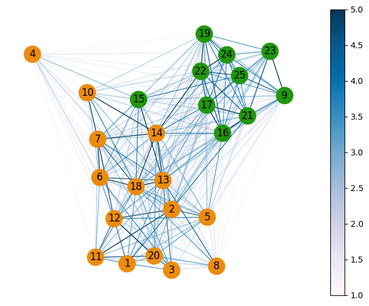

# sociogram
Rudimentary toolkit to generate a sociogram.

Some future teachers have to create [https://en.wikipedia.org/wiki/Sociogram] as part of their training. The software support for this task seems to be suboptimal. This repo aims to mitigate the apparently suboptimal software support for this task.

## Data Collection and Preparation

**Ensure that the collected data is anonymized before processing it on a public web service like this!**

The data can be collected with a single question survey like: "How much do you like your classmates? Give each of the following names a rating on a scale from ⭐ to ⭐⭐⭐⭐⭐.

The results of this survey can be written to a table with N rows and N columns. Each column corresponds to one response questionaire. Each cell of that column containing a number between 1 and 5, except the cell corresponding to the author student themselves, which should contain zero. When ordering the columns in the same way as the names on the list The resulting table can be interpreted as a quadratic NxN matrix with zeros on its main diagonal (from upper left to lower right). This matrix should be exported as CSV-file (with some standard spreadsheet software like libre office calc). CSV is a text format with "**c**omma **s**eparated **v**alues". The next step is to open that text file and to copy its complete content to the clipboard.

## Usage

The toolkit is implemented as jupyter notebook which can be run directly in the browser via the webservice https://mybinder.org/.

- View jupyter notebook: [https://nbviewer.org/...](https://nbviewer.org/github/cknoll/sociogram/main?urlpath=/tree/notebooks)
- Run jupyter notebook:
    - Open this link in a new tab: .
        - This will start a virtual machine, install all necessary dependencies and run the notebook.
    - If the virtual machine is up and ready open the notenbook `sociogram.ipynb`
    - Paste your CSV data in the second cell
    - Chose *Cell* → *Run all* from the menu to create graphical output for your data.
    - Use *Save image as ...* from the context menu to store the image to your device.

## Background

The data from the table is converted to a symmetric matrix, which is then interpreted as the [adjacency matrix](https://en.wikipedia.org/wiki/Adjacency_matrix) of an undirected graph. This graph is then rendered with a [Force-directed graph drawing](https://en.wikipedia.org/wiki/Force-directed_graph_drawing#CITEREFFruchtermanReingold1991) based on an algorithm by Fruchterman and Reingold (1991) which is implemented in the python library `networkx`. To achieve better visual results (to render clusters more distinct) the small values (<=3) in the matrix are decreased by factor 10.

This visualization method was loosely inspired by the blog post: <https://ros-developer.com/2017/12/16/populating-directed-graph-networkx-csv-adjacency-matrix/>.
